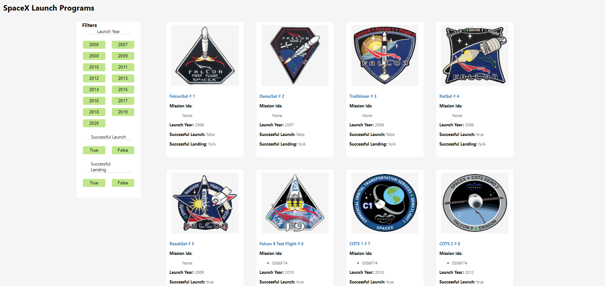
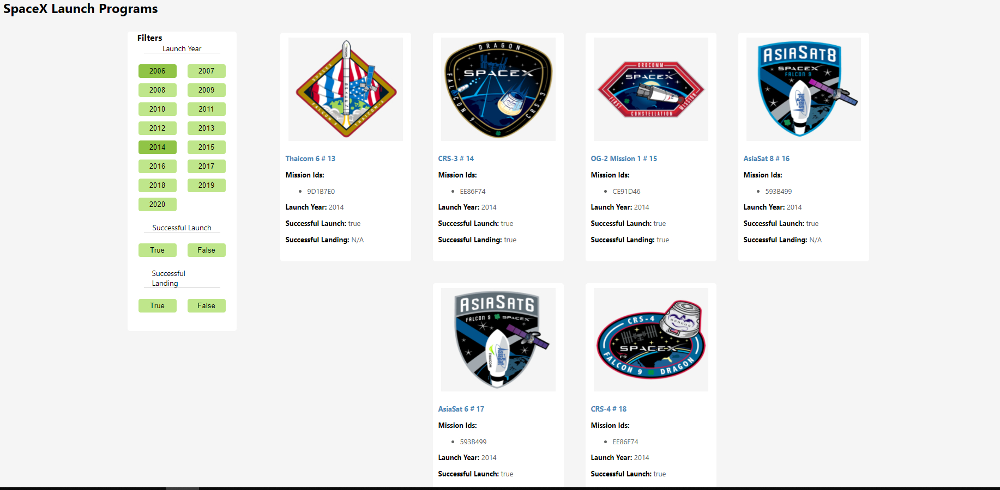
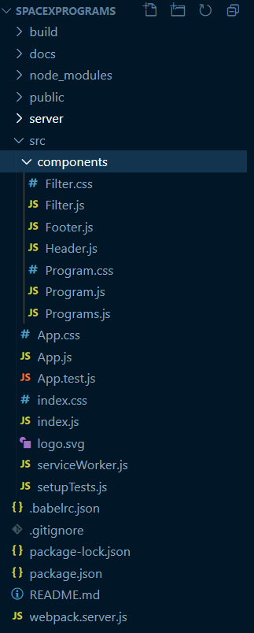
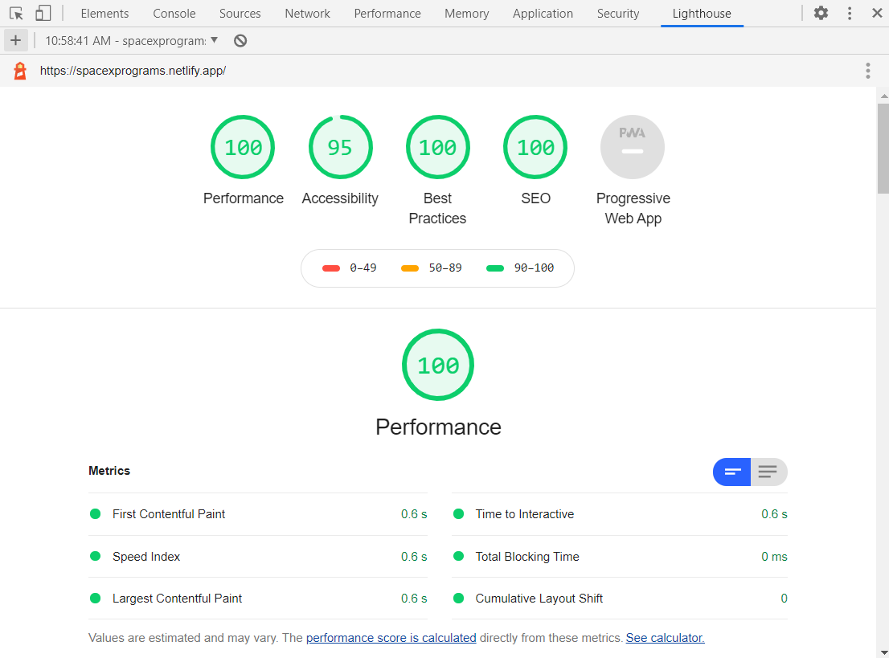

## SpaceX Programs
SpaceX Programs is a webpage developed for displaying a list of all programs SpaceX has launched with Launch-Year, Launch-Success and Land-Success filters.

## Build status

 
## Screenshots
Include logo/demo screenshot etc.
**Webpage view**
<table>
    <tr>
        <td>
            
        </td>
        <td>
            
        </td>
    </tr>
</table>

**Project Structure**
 
 

**Lighthouse score**
 
 

## Tech/framework used

<b>Built with</b>
- [Visual Studio Code](https://code.visualstudio.com/)

<b>Created with</b>
- [ReactJS](https://reactjs.org/)

## Code Details
This app was created using create-react-app.
The src folder, which contains the App.js file, in the code structure contains a components folder which houses the individual components and their style files.
- **App.js:** Class-based component with state management  
- **Header.js:** Functional component  
- **Footer.js:** Functional component  
- **Programs.js:** Functional component  
- **Program.js:** Functional component 

Apart from these components files, the structure contains .bablerc.json file for babel presets and webpack.server.json for Server-side rendering.

## How to use?
- **Get the latest code:**
[Clone the repository](). You will need node and npm installed globally on your machine.
- **Installation**: npm install
- **To run tests**: npm test
- **To start server**: npm start
- **Access on localhost**: localhost:3000

## API Reference

Used [SpaceX API](https://api.spaceXdata.com/v3/launches)